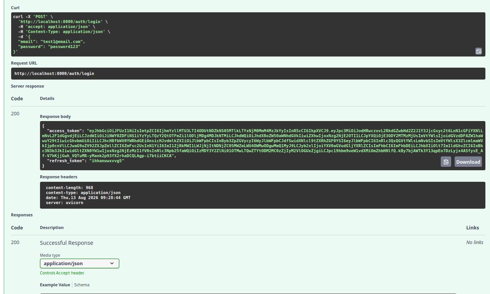
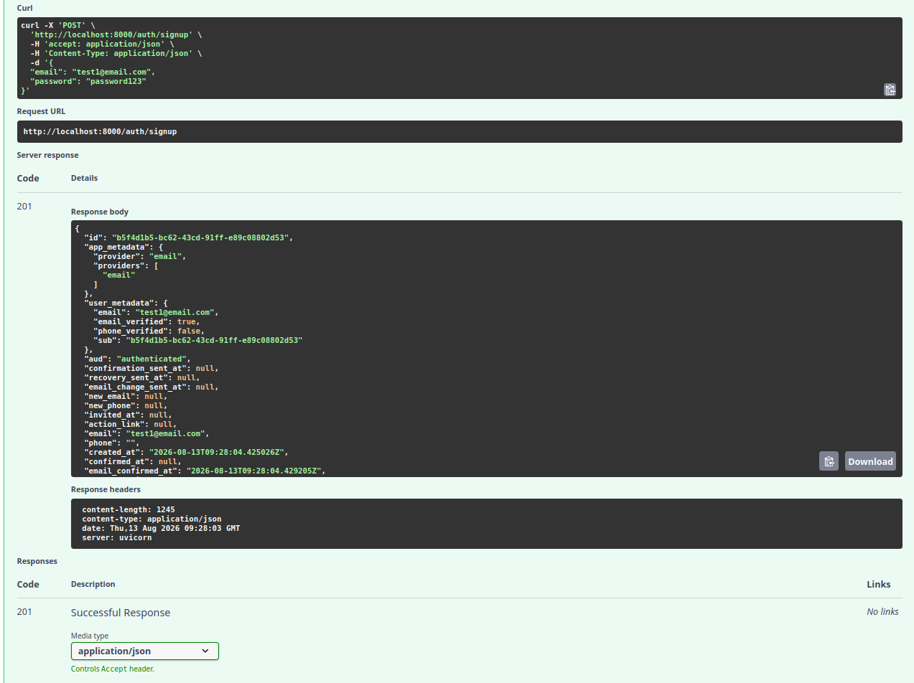

# Supabase Authentication API

## What the Project Is

This project is a **FastAPI authentication service integrated with Supabase**.

It implements a complete authentication flow:

* User registration
* User login with email and password
* JWT access-token verification
* Protected API routes
* Reusable authentication dependency
* User logout
* Public and protected endpoints

Supabase handles the authentication backend, while FastAPI provides the API layer.

## Environment Setup

### 1. Create a Supabase Project

Create a free project at **supabase.com**.

From the Supabase Dashboard, go to:

**Project Settings → API**

Copy:

* Project URL
* `anon` / public key

Do **not** use the `service_role` key.

### 2. Create `.env`

Create a `.env` file in the project root:

```env
SUPABASE_URL=your_project_url
SUPABASE_KEY=your_anon_key
PORT=8000
```

### 3. Install Dependencies

```bash
pip install fastapi uvicorn supabase python-dotenv
```

### 4. Protect Your Secrets

Add `.env` to `.gitignore`:

```gitignore
.env
venv/
__pycache__/
```

### 5. Supabase Email Setting

For this practice project, disable email confirmation:

**Authentication → Sign In / Providers → Email → Confirm email → Off**

This allows newly registered users to log in immediately.

In a production application, email confirmation should normally remain enabled.

## Run the Project

Start the server with this one command:

```bash
uvicorn main:app --reload --port 8000
```

The API will be available at:

```text
http://localhost:8000
```

## API Reference

| Method | Endpoint               | Auth Required | Description                                                        |
| ------ | ---------------------- | ------------- | ------------------------------------------------------------------ |
| `POST` | `/auth/signup`         | No            | Register a new user                                                |
| `POST` | `/auth/login`          | No            | Log in and receive access/refresh tokens                           |
| `GET`  | `/public/info`         | No            | Public information                                                 |
| `GET`  | `/protected/profile`   | Yes           | Return authenticated user's safe metadata                          |
| `POST` | `/auth/logout`         | Yes           | Log out the authenticated user                                     |
| `GET`  | `/protected/dashboard` | Yes           | Example of another route protected by the reusable auth dependency |

> The assignment's main API reference contains five core endpoints; `/protected/dashboard` is an additional checkpoint endpoint demonstrating that the authentication guard can be reused without writing new authentication logic.

## Authentication

Protected endpoints require the access token returned by `/auth/login`.

Send it using:

```http
Authorization: Bearer <access_token>
```

The reusable FastAPI dependency extracts the token and asks Supabase to verify it.

Invalid, expired, missing, or malformed tokens result in:

```json
{
  "error": "Invalid or expired token"
}
```

with HTTP status `401`.


### Login



### Signup



## Example Login Response

```json
{
  "access_token": "eyJ...",
  "refresh_token": "..."
}
```

Use the `access_token` when calling protected endpoints.

## Example Protected Request

```bash
curl -i http://localhost:8000/protected/profile \
-H "Authorization: Bearer YOUR_ACCESS_TOKEN"
```

A valid token returns the authenticated user's safe metadata, such as:

```json
{
  "id": "user-id",
  "email": "user@example.com",
  "created_at": "2026-08-12T20:40:14.206369Z"
}
```
##
```bash
A JWT contains a header describing the signing algorithm, a payload containing claims such as the user ID, email, role, and expiry time, and a cryptographic signature used to verify that it hasn't been tampered with. You should never put passwords, API keys, or other secrets in a JWT because its header and payload are encoded, not encrypted, so anyone who has the token can decode and read them.
```
